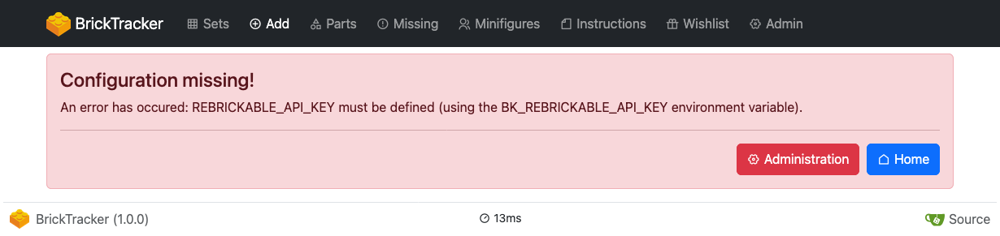
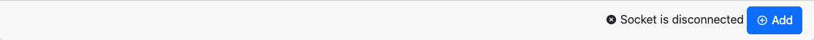
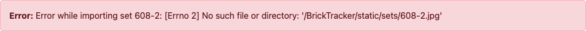
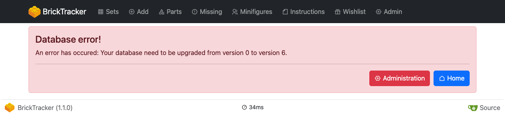

# Common errors/problems

> **Note**
> The following page is based on version `1.1.0` of BrickTracker.

## I need a password to access some pages

You have setup [lightweight authentication](authentication.md). Your password is in your environement `BK_AUTHENTICATION_PASSWORD` variable.

## I cannot access the Add page (Configuration missing!)



You need to pass the `BK_REBRICKABLE_API_KEY` environment to your application, depending on how you run the application.
See [setup](setup.md) for more information.

## The socket is disconnected



If you are seeing the socket disconnected while you are on the **Add** or **Bulk add** pages, it can mean:

- The application is not running anymore (it somehow stopped after you accessed the page): check that the application is running and its log for errors,
- You restarted the application and it can take some time for the socket to be back up: just wait a bit it should automatically re-connect,
- You are using the CORS allowed origin restriction (via the `BK_DOMAIN_NAME` environment variable) with a mismatching value: you should see a log line similar to this following one in your application logs.

```
http://127.0.0.1:3333 is not an accepted origin. (further occurrences of this error will be logged with level INFO)
[2025-01-18 18:15:52,980] ERROR - http://127.0.0.1:3333 is not an accepted origin. (further occurrences of this error will be logged with level INFO)
```

Make sure the value you have set is matching the URL of your application.
If it is not the case, adjust the value and restart the application.


## No such file or directory: '&lt;path&gt;' when adding a set



The application doestake care of creating folders for static images and expects them to be writable.
Make sure that the folder exists, and if it exists that it is writable by the application.

## I'm seeing Unknown (&lt;number&gt;) instead of the set theme


Either the theme is too recent for your version of the themes file, or your theme file has not be initialized.
Head to the **Admin** page, **Themes** section and update the file.

## Your database need to be upgraded from version &lt;current&gt; to version &lt;required&gt;.



A database schema modification was necessary to implement new features and the database need to be upgraded from the **Admin** page. See [upgrade your database](upgrade-database.md) for more information.
