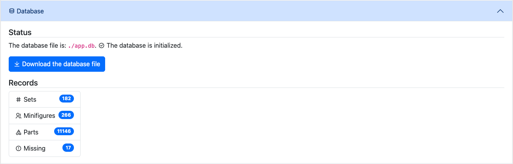
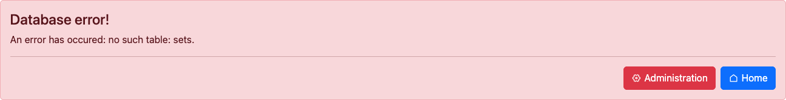
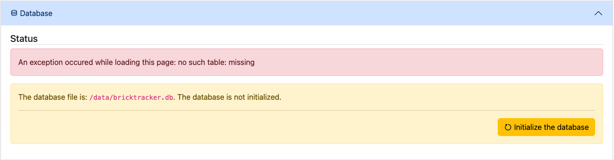
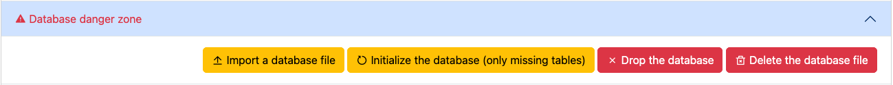
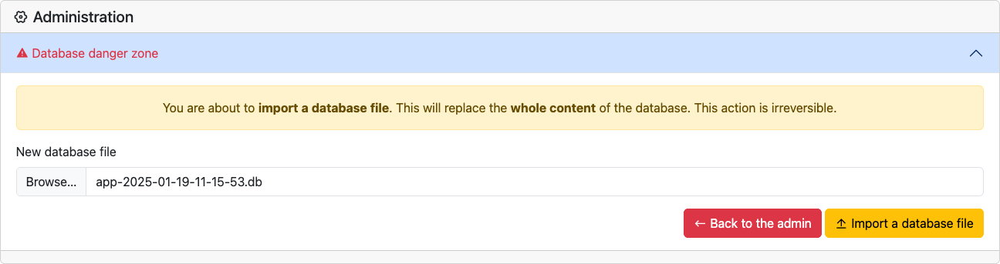
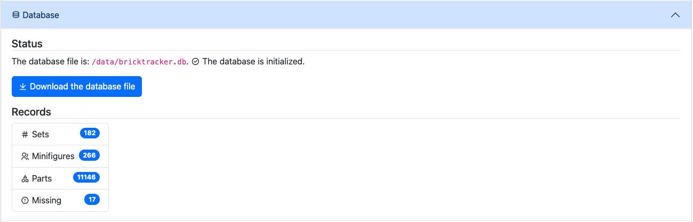

# Move an existing ./app.db database

If you are coming from the original version of BrickTracker and you wish to move your database from a bind mount to a volume, you can follow this procedure.

> **Note**
> If you already have a copy of your `app.db` file easily available, you can skip directly to "Move the database" section

## Update to version 1.0.0

Follow the release instructions to upgrade your application to version `1.0.0`.

**However**, make sure you unset the `BK_DATABASE_PATH` variable, or set it with the value `./app.db`. For instance:

```
services:
  bricktracker:
    container_name: BrickTracker
    restart: unless-stopped
    image: gitea.baerentsen.space/frederikbaerentsen/bricktracker:1.0.0
    ports:
      - "3333:3333"
    volumes:
      - ./app.db:/app/app.db
      - data:/data/
      - instructions:/app/static/instructions/
      - minifigures:/app/static/minifigures/
      - parts:/app/static/parts/
      - sets:/app/static/sets/
    # Or define those in your .env file
    environment:
      #BK_DATABASE_PATH: /data/app.db
      BK_MINIFIGURES_FOLDER: minifigures
      BK_RETIRED_SETS_PATH: /data/retired_sets.csv
      BK_THEMES_PATH: /data/themes.csv
    #env_file: ".env"

volumes:
  data:
  instructions:
  minifigures:
  parts:
  sets:
```

Redeploy your application to version `1.0.0`

## Download your database file

You should see the new version of the application running.
Go to the **Admin** page, and in the **Database** section press the **Download the database file** button.
This will download a copy of the database file to your computer.



## Move the database

Now that you have a copy of your database, you can tell the application its new path.
Edit the `BK_DATABASE_PATH` environment variable and redeploy your application.

> **Note**
> The name of the database file does not have to be `app.db`

For instance:

```
services:
  bricktracker:
    container_name: BrickTracker
    restart: unless-stopped
    image: gitea.baerentsen.space/frederikbaerentsen/bricktracker:1.0.0
    ports:
      - "3333:3333"
    volumes:
      - data:/data/
      - instructions:/app/static/instructions/
      - minifigures:/app/static/minifigures/
      - parts:/app/static/parts/
      - sets:/app/static/sets/
    # Or define those in your .env file
    environment:
      BK_DATABASE_PATH: /data/bricktracker.db
      BK_MINIFIGURES_FOLDER: minifigures
      BK_RETIRED_SETS_PATH: /data/retired_sets.csv
      BK_THEMES_PATH: /data/themes.csv
    #env_file: ".env"

volumes:
  data:
  instructions:
  minifigures:
  parts:
  sets:
```

Redeploy your application.

## Upload the database

When you reload the page of your application, you will be greeted with an error message.
This is expected as you have told the application the database has moved somewhere else.



Navigate the **Admin** page once again.
You should see that the path has changed and the database is not initialized.



This time open the **Database danger zone**.



Press the **Import a database file** file and select the file you downloaded earlier.



Press the **Import a database file** button.



Done. Your records should be back.

## Update other files

While you are at it, check the following sections to make sure everything is ok:

- Default images
- Themes
- Retired sets
