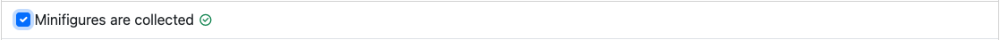
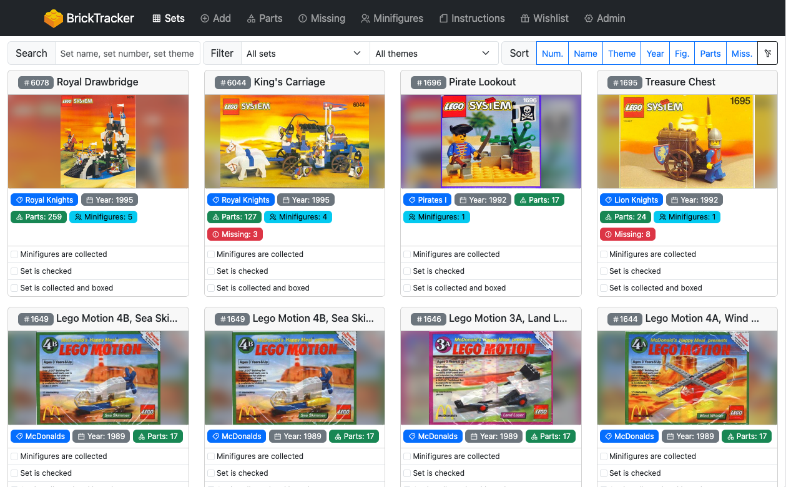
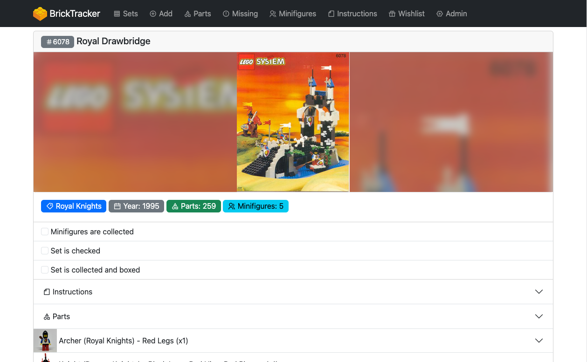
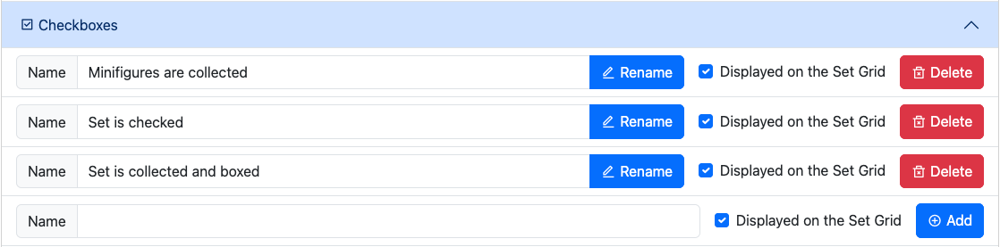
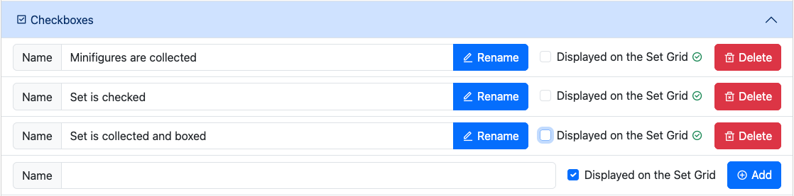
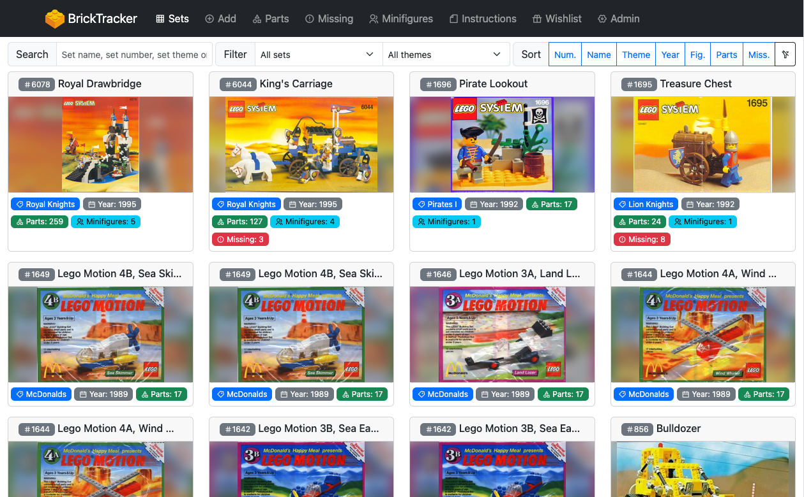
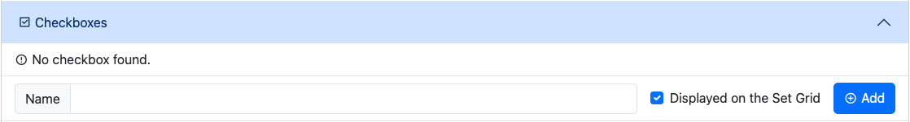

# Manage your set statuses

> **Note**
> The following page is based on version `1.1.0` of BrickTracker.

> **Note**
> On version `1.2.0`, this feature has been renommed from `Checkboxes` to `Set statuses`. It works exactly the same.

They are useful to store "yes/no" info about a set and quickly set it. Once clicked the change is immediatly stored in the database. A visual indicator tells you the change was succesful.

## Default statuses

The original version of BrickTracker defined the following statuses

- Minifigures are collected
- Set is checked
- Set is collected and boxed

## Visibility

The statuses are **never visible** on the front page. The display here tries to be as minimalistic as possible.

Prior to version `1.1.0`, the statuses were visible both on the Grid view (**Sets**) and the details of a set.

From version `1.1.0`, it is possible to decide if a status is visible from the Grid or not. It will always be visible in a set details.

### Change the visibility of a status

> **Note**
> On version `1.2.0`, the Admin page section has been renamed from `Checkboxes` to `Set statuses`. It works exactly the same.

To change the visibility of a status, head to the **Admin page** and open the **Set statuses** section.

Simply click on the **Displayed on the Set Grid** status to select whether it is displayed or not. The change is immediately saved to the database.

In this example, we have decided to have no status visible on the Grid view.

## Management

> **Note**
> On version `1.2.0`, the Admin page section has been renamed from `Checkboxes` to `Set statuses`. It works exactly the same.

Starting version `1.1.0`, you can manage the set statuses for the **Set statuses** section of the **Admin page**.

From there you can do the following:

- Add a new set status: use the last line of the list and press the **Add** button
- Rename an existing set status: use the **Name** field to change the name and press the **Rename** button
- Change the Grid display of an existing status: tick or untick the **Displayed on the Set Grid** checkbox
- Delete an existing set status: use the **Delete** button and confirm on the following screen

It is possible to delete all the set statuses, they are an optional component of a set.

