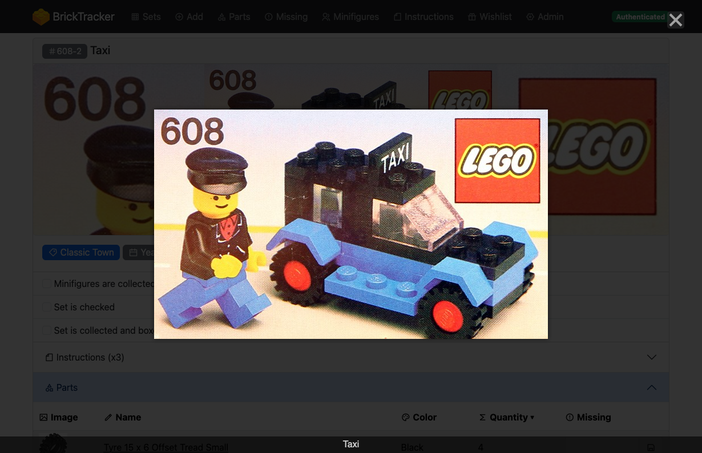
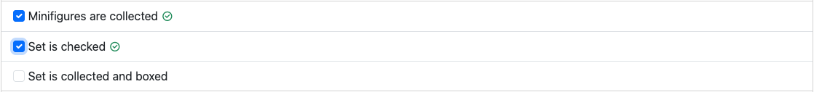
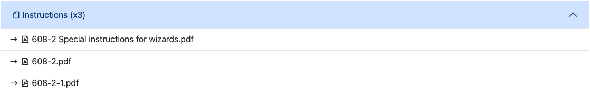
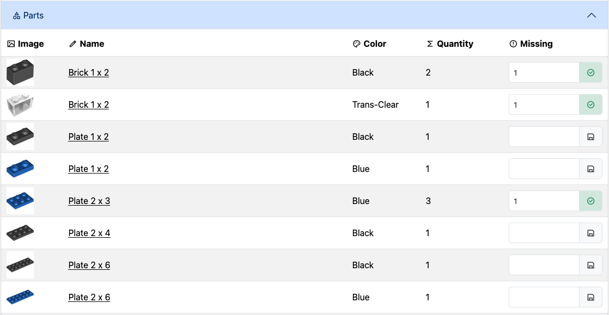
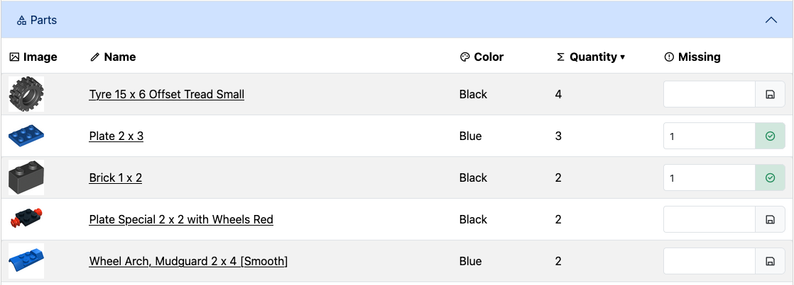
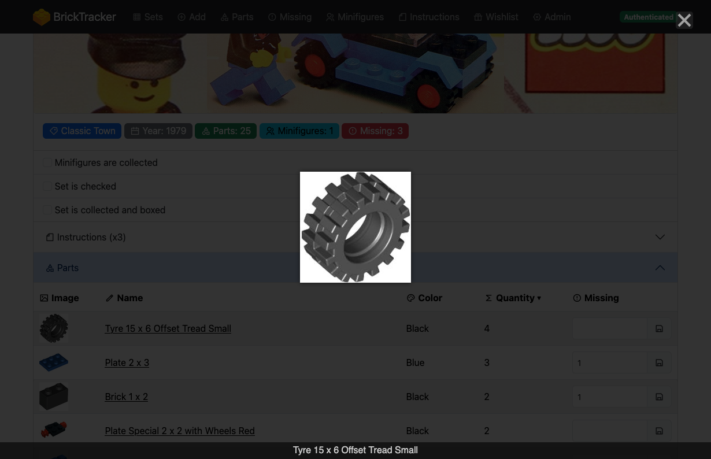
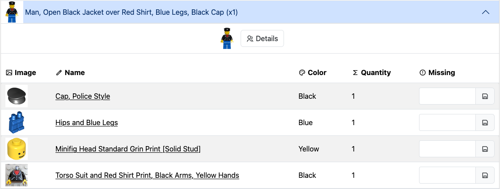
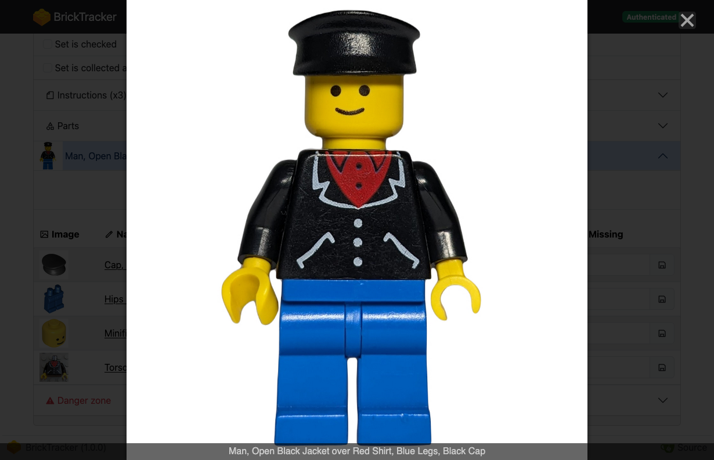
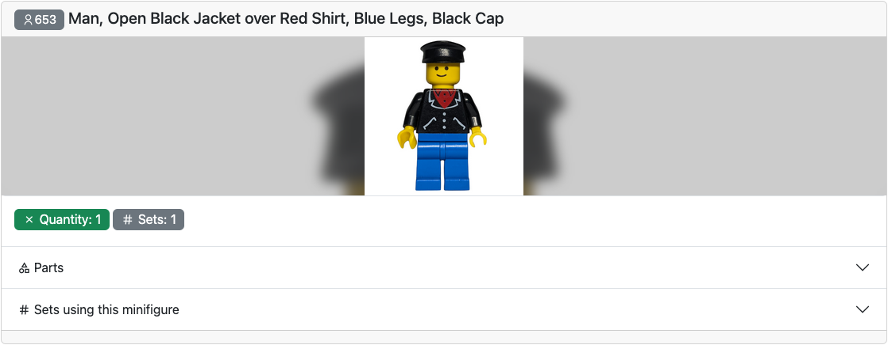

# Managing your sets

> **Note**
> The following page is based on version `1.0.0` of BrickTracker.

## Set image

If you click the set image, it will open fullscreen.

## Set status

You can track the following status for your sets:

- Set is checked
- Set is collected
- Set minifigures are collected

Simply click on the checkbox or label wherever applicable and it will be immediately saved to the database.
A little status mark tells you if the operation was successful.

# Instructions

If you have uploaded instructions with a name matching the set, they will be available to consult on the set page.

## Parts list

When displaying a set, you can see the list of parts making the set.
For each part, you can mark how many of those pieces are missing.
As soon as you leave the field it will be immediately saved to the database.
A little status mark tells you if the operation was successful.

You can sort the part list by clicking the header of each column of the table.

If you click a part image, it will open fullscreen.

## Minifigures list

If the set includes minifigures, they will be least after the parts list.
For each minifigure kind, you will see the number of minifigures and their part list.
The part list works exactly like the set parts list.

If you click the minifigure image near the **Details** button, it will open fullscreen.

You can also check the details of the minifigure pressing by clicking on the **Details** button.

