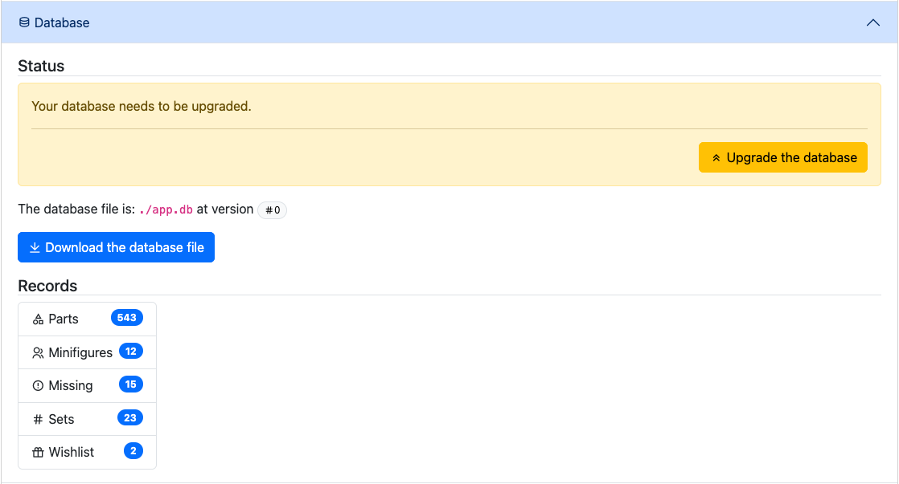
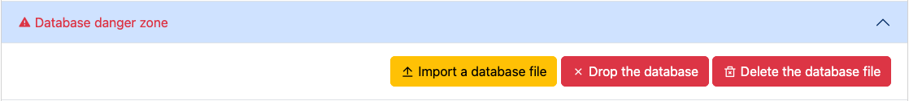
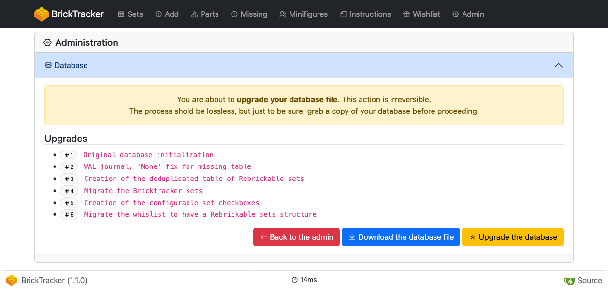
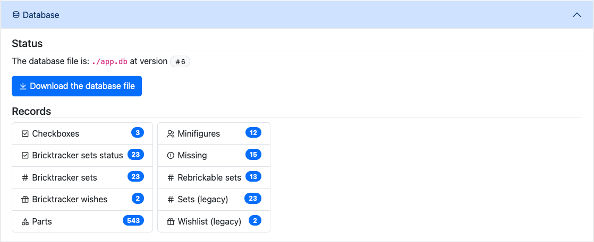

# Upgrade your database

Sometimes, it is necessary to perform structural changes to the database to implement new features.
A built-in tool is in charge of this task, however it is not automatic (because is rare case it can lead to unexpected results.)

To perform a database upgrade, you need to navigate to the **Admin page**.

## Backup your data

> **Warning**
> Even if the migration steps are crafted so that your data is preserved, there can be unexpected results.
> **ALWAYS BACKUP YOUR DATA BEFORE PROCEEDING WITH A MIGRATION**.

To back up your data, use the **Download the database file** button. It will download a copy of the database file to your disk.
The file will be named: `<name>-v<version>-year-month-day-hours-minutes-secondes.db`.

### Restore a backup

In case of a problem, you can always use the **Import a database file** button in the **Database danger zone**.

## Perform the upgrade

The upgrade procedure is automated, you simply need to start it. Press the **Upgrade the database** button to see the planned list of changes.

Confirm by pressing the **Upgrade the database** button once more.
Once the upgrade is done you wil be back to the **Admin page**. You can see that your database file is at the required version.

